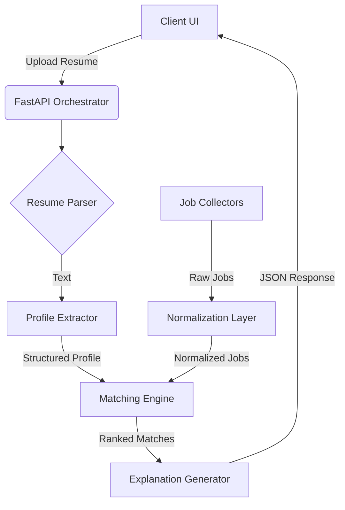

# Resumi 🚀


**Resumi** is an intelligent, resume-first job discovery engine designed to bridge the gap between candidates and their ideal roles. Unlike traditional job boards that rely on keyword spamming, Resumi uses natural language processing to understand a candidate's profile—skills, experience, and seniority—and matches them with curated opportunities from reliable sources.

---

## 🌟 Key Features

- ** Resume Intelligence**: Parses PDF/DOCX resumes to extract structured data (skills, experience, role family).
- **🎯 Smart Matching**: Scoring algorithms that weigh location, skill overlap, and career progression.
- **🌍 Unified Discovery**: Aggregates jobs from RSS feeds (WeWorkRemotely, RemoteOK) and generates smart search URLs for major portals (Naukri, Instahyre).
- ** transparent Explanations**: "White-box" AI that explains *why* a job is a match (e.g., "Matches your 5 years of Python experience").
- **⚡ Modern Architecture**: Built with FastAPI for high performance and easy extensibility.

---

## 🏗️ Architecture

Resumi follows a modular microservices-ready architecture:



## 🚀 Getting Started

### Prerequisites

- Python 3.9+
- pip (Python package manager)

### Installation

1.  **Clone the repository**
    ```bash
    git clone https://github.com/yourusername/resumi.git
    cd resumi
    ```

2.  **Create a virtual environment**
    ```bash
    python -m venv .venv
    # Windows
    .venv\Scripts\activate
    # macOS/Linux
    source .venv/bin/activate
    ```

3.  **Install dependencies**
    ```bash
    pip install -r requirements.txt
    ```

4.  **Download NLP models**
    ```bash
    python -m spacy download en_core_web_md
    ```

### Running the Application

1.  **Start the backend server**
    ```bash
    python start.py
    ```

2.  **Access the Dashboard**
    Open your browser and navigate to `http://localhost:8000`.

---

## 🛠️ Tech Stack

- **Backend**: Python, FastAPI, Uvicorn
- **NLP/ML**: spaCy, scikit-learn (TF-IDF/Cosine Similarity)
- **Data Processing**: Pandas, NumPy
- **Frontend**: Vanilla JS, HTML5, CSS3 (keeps it lightweight and fast)
- **Testing**: Pytest

---

## 🤝 Contributing

Contributions are welcome! Please read our [Contributing Guidelines](CONTRIBUTING.md) for details on our code of conduct and the process for submitting pull requests.

1.  Fork the Project
2.  Create your Feature Branch (`git checkout -b feature/AmazingFeature`)
3.  Commit your Changes (`git commit -m 'Add some AmazingFeature'`)
4.  Push to the Branch (`git push origin feature/AmazingFeature`)
5.  Open a Pull Request

---

## 📄 License

Distributed under the MIT License. See `LICENSE` for more information.

---

## 📞 Contact

Project Link: [https://github.com/yourusername/resumi](https://github.com/yourusername/resumi)
